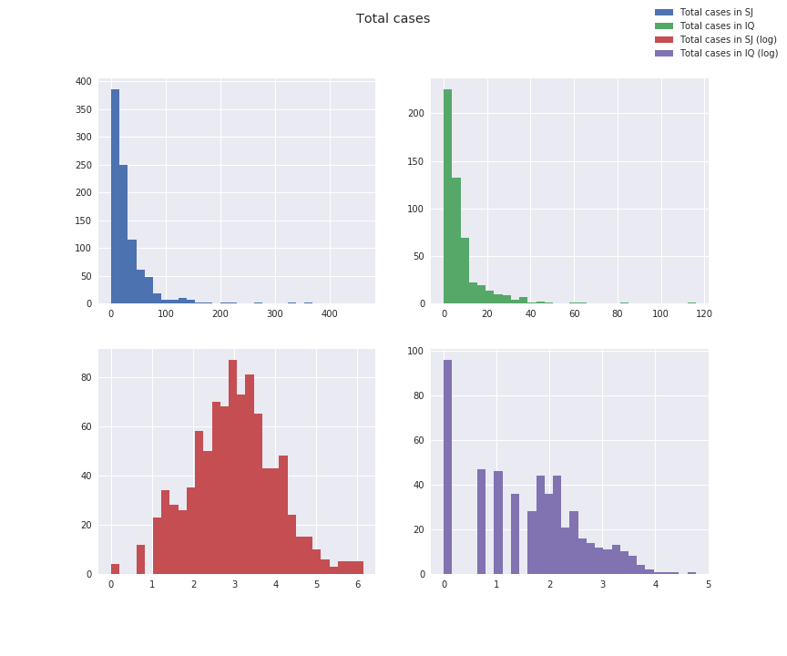

# DengAI: Disease Spreading Prediction
### *Udacity Machine Learning Engineer - Capstone report*

## A. Problem definition

### 1. Project overview

> Student provides a high-level overview of the project in layman’s terms. Background information such as the problem domain, the project origin, and related data sets or input data is given.

As of March 2020, it seems clear that epidemic will be a growing concern worldwide.

However other epidemic than COVID-19 (technically a pandemic) have occurred for centuries, and many are still occurring today. Although epidemics such as COVID-19 are next to impossible to predict because the causality is similar to the butterfly effect, other epidemics have been ongoing for years with seasonality and others have been linked to climate changes.

This is thought to be the case for mosquito-transmitted diseases as explained in [[1]](#1) and [[2]](#2), although the relationship between the two is complex: 
> climate variable may increase dengue transmission potential through one aspect of the system while simultaneously decreasing transmission potential through another. [[2]](#2)

In this project I will take part in a DrivenData competition: [DengAI: Predicting Disease Spread](https://www.drivendata.org/competitions/44/dengai-predicting-disease-spread/) where the goal is:
> to predict the number of dengue cases each week (in each location) based on environmental variables describing changes in temperature, precipitation, vegetation, and more.

Dengue disease comes from dengues viruses transmitted by several types of mosquitoes that are also known to transmit other diseases such as Zika and chikungunya. According to [[3]](#3):
> * Dengue is common in more than 100 countries
> * Forty percent of the world's population, about 3 billion people, live in areas with a risk of dengue
> * Each year, up to 400 million people get infected with dengue. Approximately 100 million people get sick from infection, and 22,000 die from severe dengue.

A quick look on Wikipedia and we can see that 15 of the 63 epidemics listed for the 21st century are dengue related, and there was a recent dengue fever outbreak in 2019-2020 [[5]](#5), with 2019 being a record year for Latin America 
> with more than 2.7 million cases and 1206 deaths during the first 10 months of 2019.

### 2. Problem statement

> The problem which needs to be solved is clearly defined. A strategy for solving the problem, including discussion of the expected solution, has been made.

The goal will be to predict the number of dengue cases for two cities, San Juan and Iquitos, per week over several years. 

More precisely, the test cases (and thus prediction span) will be:

* 2010 to 2013 for Iquitos
* 2008 to 2013 for San Juan

The data set is made of the target variable `total_cases` (cases of dengue in each city) per week, along with several weather metrics (temperature, precipitation, dew point, etc.) adn vegetation information.

Being a competition of some sort, the test set only have features and no targets, but we still can evaluate our performance as part of the competition.

Our model will be trained on the both target and selected/engineered features and will then be fed with test features to predict the target.

Our strategy will be  to improve a standard time based model (seasonality, trend, auto-correlation) with the additional features we have at hand.

Although we will evaluate our model with specific metrics (c.f. below), this project is part of the machine learning engineer nanodegree and as such we will work on AWS SageMaker solution. We have chose to work with the DeepAR Forecasting algorithm which is specific to AWS.

### 3. Evaluation and metrics

> Metrics used to measure the performance of a model or result are clearly defined. Metrics are justified based on the characteristics of the problem.

We will use the evaluation of this competition to evaluate our model against our test set which is the Mean Absolute Error [[7]](#7).

$$
{MAE} = \frac{\sum_{i=1}^n\left| y_i-x_i\right|}{n}
$$

Compared to the popular RMSE, this metric will not penalized large error as much.

We will also report the score of the submission which is done on a private test set (computed with MAE as well).

## B. Problem analysis

### 1. Data exploration

> If a dataset is present, features and calculated statistics relevant to the problem have been reported and discussed, along with a sampling of the data. In lieu of a dataset, a thorough description of the input space or input data has been made. Abnormalities or characteristics of the data or input that need to be addressed have been identified.

#### Data set description
The datasets are those provided by DrivenData.

##### Labels

The labels (or targets) will be the number of dengue cases per week for each city.

##### b. Features

There are 24 features based on weather information and vegetation for each city and week, gather from the National Oceanic and Atmoshperic Administration [[6]](#6).

###### NOAA's GHCN daily climate data weather station measurements
* `station_max_temp_c` – Maximum temperature
* `station_min_temp_c` – Minimum temperature
* `station_avg_temp_c` – Average temperature
* `station_precip_mm` – Total precipitation
* `station_diur_temp_rng_c` – Diurnal temperature range

###### PERSIANN satellite precipitation measurements (0.25x0.25 degree scale)

* `precipitation_amt_mm` – Total precipitation

###### NOAA's NCEP Climate Forecast System Reanalysis measurements (0.5x0.5 degree scale)
* `reanalysis_sat_precip_amt_mm` – Total precipitation
* `reanalysis_dew_point_temp_k` – Mean dew point temperature
* `reanalysis_air_temp_k` – Mean air temperature
* `reanalysis_relative_humidity_percent` – Mean relative humidity
* `reanalysis_specific_humidity_g_per_kg` – Mean specific humidity
* `reanalysis_precip_amt_kg_per_m2` – Total precipitation
* `reanalysis_max_air_temp_k` – Maximum air temperature
* `reanalysis_min_air_temp_k` – Minimum air temperature
* `reanalysis_avg_temp_k` – Average air temperature
* `reanalysis_tdtr_k` – Diurnal temperature range

###### Satellite vegetation - Normalized difference vegetation index (NDVI) - NOAA's CDR Normalized Difference Vegetation Index (0.5x0.5 degree scale) measurements
* `ndvi_se` – Pixel southeast of city centroid
* `ndvi_sw` – Pixel southwest of city centroid
* `ndvi_ne` – Pixel northeast of city centroid
* `ndvi_nw` – Pixel northwest of city centroid

##### c. Spatiality and temporality

The data is indexex by year, week of the year and city.

##### c. Train and Test data

The train data set spans from:
* 2000 to 2010 for Iquitos
* 1990 to 2008 for San Juan

We have 520 and 936 inputs the train data for Iquitos and San Juan respectively.

The test data set spans from 
* 2010 to 2013 for Iquitos
* 2008 to 2013 for San Juan

We have 156 and 260 inputs the test data for Iquitos and San Juan respectively.

#### Missing values

There are a few missing values for certain features both for train and test data sets, but the target, city, and date information are complete.

The most missing values were for the `ndvi` features. They are quite correlated to each other so we were able to impute them.

Similarly `station` features had some missing values but since they are mostly 100% correlated with the `reanalysis` we will be able to simply drop these features.

We also had an issue with the 53th week for several years.

#### Descriptive statistics

The target variable `total_cases` is left skewed. Taking the log of it allows for a good normalization for SJ but falls short for IQ.

#### Correlations 

#### Time analysis

### 2. Exploratory visualization

> A visualization has been provided that summarizes or extracts a relevant characteristic or feature about the dataset or input data with thorough discussion. Visual cues are clearly defined.

#### Focus on total cases

pike and seasonality

### 3. Algorithms and Techniques

> Algorithms and techniques used in the project are thoroughly discussed and properly justified based on the characteristics of the problem.

Our problem focus on a time serie prediction that depends on other time series. Although the target shows some seasonality, there are also some high pikes that are not obviously explainable. We hope to use the additional features to better predict them.

We have chosen to work mostly with DeepAR Forecasting Algorithm [[8]](#8), which is a LTSM neural network.

The target time series can be associated with other time series, and can also be categorized. In our case, we can thus associate weather realted time series with the number of denge cases as well as categorize our time series in one of the two cities.

The algorithm also automatically derives additional time series based on the frequency of the target time serie. In our case, the frequency is weekly and as such the algorithm will derive the day of month and week of year.

### 4. Benchmark

> Student clearly defines a benchmark result or threshold for comparing performances of solutions obtained.

The people at DrivenData have conveniently proposed a benchmark model using a Negative Binomial model with a final Mean Absolute Error of 6.47, and a score of submission of 25.8173 (current #1 is 10.1010).

## C. Methodology

### 1. Data Preprocessing

> All preprocessing steps have been clearly documented. Abnormalities or characteristics of the data or input that needed to be addressed have been corrected. If no data preprocessing is necessary, it has been clearly justified.

We imputed the missing values using scikit-learn [IterativeImputer](https://scikit-learn.org/stable/modules/generated/sklearn.impute.IterativeImputer.html#sklearn.impute.IterativeImputer):
> Multivariate imputer that estimates each feature from all the others.

We then scale our data using scikit-learn [StandardScaler](https://scikit-learn.org/stable/modules/generated/sklearn.preprocessing.StandardScaler.html) which standardize features by removing each features's mean and reducing variance to 1.
Altough the paper on DeepAR[[9]](#9) seems to indicate that they have taken care of it, we have observed improvement on both validation and test sets.

Regarding the target variable, we took the log of it as it was heavily skewed ot the left. We saw an improvment both on validation and test sets.

### 2. Implementation

> The process for which metrics, algorithms, and techniques were implemented with the given datasets or input data has been thoroughly documented. Complications that occurred during the coding process are discussed.

#### a.

#### b. AWS SageMaker complications

Time series

### 3. Refinement

> The process of improving upon the algorithms and techniques used is clearly documented. Both the initial and final solutions are reported, along with intermediate solutions, if necessary.

After a lot of try and error, we ended up with a fully working pipeline from data downloading up to submission file generation, allowing us to test new ideas, evaluate them on a validation set and if considered worthwile, generate a submission.

To be able to track models and scores, we implemented a few helper functions to store model parameters and information in CSV files, as well as unique model tagging.

We started out with only the target variable as input to the model to be used as a baseline. We then added features of interest and testing them out on the validation set.

We then tried several feature preprocessing ideas.

## D. Results

### 1. Model Evaluation and Validation

> The final model’s qualities—such as parameters—are evaluated in detail. Some type of analysis is used to validate the robustness of the model’s solution.

### 2. Justification

> The final results are compared to the benchmark result or threshold with some type of statistical analysis. Justification is made as to whether the final model and solution is significant enough to have adequately solved the problem.

This problem will be solved by training a Recurrent Neural Network to predict the number of dengue cases per week based on this week's features and prior week information.

## E. Conclusions

## Resources

* <a id="1">[1]</a>: Lindsay P. Campbell, Caylor Luther, David Moo-Llanes, Janine M. Ramsey, Rogelio Danis-Lozano and A. Townsend Peterson. 2015. Climate change influences on global distributions of dengue and chikungunya virus vectors. Phil. Trans. R. Soc. B370: 20140135. https://doi.org/10.1098/rstb.2014.0135
* <a id="2">[2]</a>: Morin CW, Comrie AC, Ernst KC. 2013. Climate and dengue transmission: evidence and implications. Environ Health Perspect 121:1264–1272. https://doi.org/10.1289/ehp.1306556
* <a id="3">[3]</a>: Centers for Disease Control and Prevention, National Center for Emerging and Zoonotic Infectious Diseases (NCEZID), Division of Vector-Borne Diseases (DVBD) https://www.cdc.gov/dengue/about/index.html
* <a id="4">[4]</a>: List of epidemics https://en.wikipedia.org/wiki/List_of_epidemics#21st_century
* <a id="5">[5]</a>: 2019–2020 dengue fever epidemic https://en.wikipedia.org/wiki/2019%E2%80%932020_dengue_fever_epidemic
* <a id="6">[6]</a>: National Oceanic and Atmoshperic Administration https://www.noaa.gov/
* <a id="7">[7]</a>: Mean absolute error https://en.wikipedia.org/wiki/Mean_absolute_error
* <a id="8">[8]</a>: DeepAR Forecasting Algorithm https://arxiv.org/abs/1704.04110(https://docs.aws.amazon.com/sagemaker/latest/dg/deepar.html)
* <a id="9">[9]</a>: DeepAR: Probabilistic Forecasting with Autoregressive Recurrent Networks https://arxiv.org/abs/1704.04110
