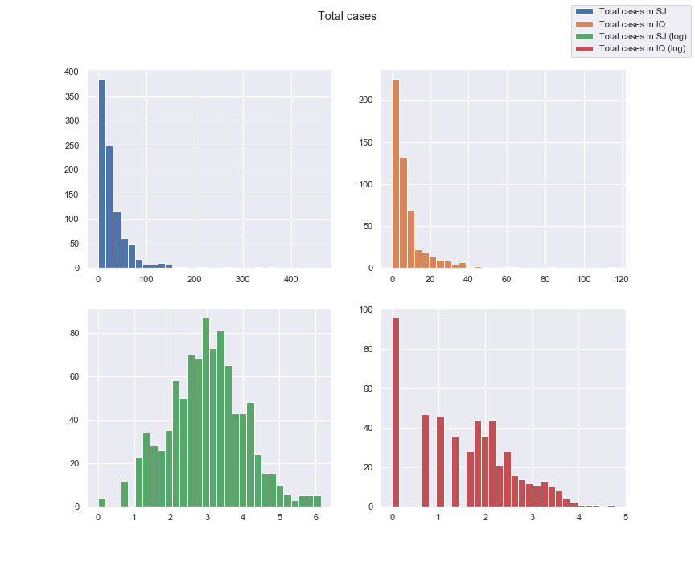
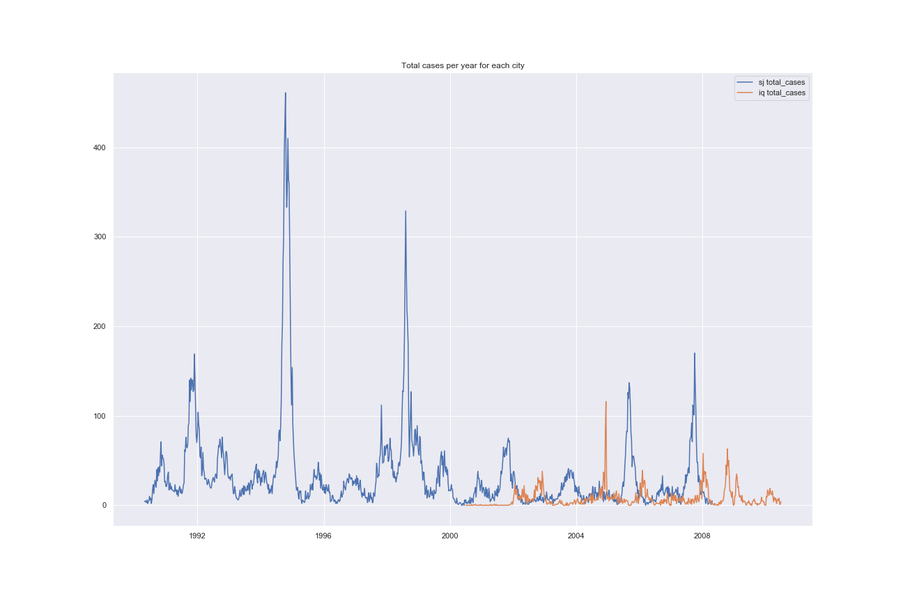
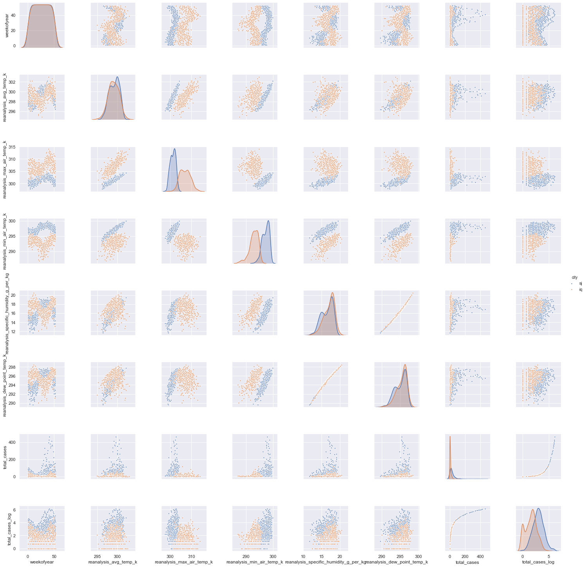

# DengAI: Disease Spreading Prediction
### *Udacity Machine Learning Engineer - Capstone report*

## A. Problem definition

### 1. Project overview

As of March 2020, it seems clear that epidemic will be a growing concern worldwide.

However other epidemic than COVID-19 (technically a pandemic) have occurred for centuries, and many are still occurring today. Although epidemics such as COVID-19 are next to impossible to predict because the causality is similar to the butterfly effect, other epidemics have been ongoing for years with seasonality and others have been linked to climate changes.

This is thought to be the case for mosquito-transmitted diseases as explained in [[1]](#1) and [[2]](#2), although the relationship between the two is complex: 
> climate variable may increase dengue transmission potential through one aspect of the system while simultaneously decreasing transmission potential through another. [[2]](#2)

In this project I will take part in a DrivenData competition: [DengAI: Predicting Disease Spread](https://www.drivendata.org/competitions/44/dengai-predicting-disease-spread/) where the goal is:
> to predict the number of dengue cases each week (in each location) based on environmental variables describing changes in temperature, precipitation, vegetation, and more.

Dengue disease comes from dengues viruses transmitted by several types of mosquitoes that are also known to transmit other diseases such as Zika and chikungunya. According to [[3]](#3):
> * Dengue is common in more than 100 countries
> * Forty percent of the world's population, about 3 billion people, live in areas with a risk of dengue
> * Each year, up to 400 million people get infected with dengue. Approximately 100 million people get sick from infection, and 22,000 die from severe dengue.

A quick look on Wikipedia and we can see that 15 of the 63 epidemics listed for the 21st century are dengue related, and there was a recent dengue fever outbreak in 2019-2020 [[5]](#5), with 2019 being a record year for Latin America 
> with more than 2.7 million cases and 1206 deaths during the first 10 months of 2019.

### 2. Problem statement

> The problem which needs to be solved is clearly defined. A strategy for solving the problem, including discussion of the expected solution, has been made.

The goal will be to predict the number of dengue cases for two cities, San Juan and Iquitos, per week over several years. 

More precisely, the test cases (and thus prediction span) will be:

* 2010 to 2013 for Iquitos
* 2008 to 2013 for San Juan

The data set is made of the target variable `total_cases` (cases of dengue in each city) per week, along with several weather metrics (temperature, precipitation, dew point, etc.) adn vegetation information.

Being a competition of some sort, the test set only have features and no targets, but we still can evaluate our performance as part of the competition.

Our model will be trained on the both target and selected/engineered features and will then be fed with test features to predict the target.

Our strategy will be  to improve a standard time based model (seasonality, trend, auto-correlation) with the additional features we have at hand.

Although we will evaluate our model with specific metrics (c.f. below), this project is part of the machine learning engineer nanodegree and as such we will work on AWS SageMaker solution. We have chose to work with the DeepAR Forecasting algorithm which is specific to AWS.

### 3. Evaluation and metrics

We will use the evaluation of this competition to evaluate our model against our test set which is the Mean Absolute Error [[7]](#7).

$$
{MAE} = \frac{\sum_{i=1}^n\left| y_i-x_i\right|}{n}
$$

Compared to the popular RMSE, this metric will not penalized large error as much.

We will also report the score of the submission which is done on a private test set (computed with MAE as well).

## B. Problem analysis

### 1. Data exploration

> If a dataset is present, features and calculated statistics relevant to the problem have been reported and discussed, along with a sampling of the data. In lieu of a dataset, a thorough description of the input space or input data has been made. Abnormalities or characteristics of the data or input that need to be addressed have been identified.

#### Data set description
The datasets are those provided by DrivenData.

##### Labels

The labels (or targets) will be the number of dengue cases per week for each city.

##### b. Features

There are 24 features based on weather information and vegetation for each city and week, gather from the National Oceanic and Atmoshperic Administration [[6]](#6).

###### NOAA's GHCN daily climate data weather station measurements

* `station_max_temp_c` – Maximum temperature
* `station_min_temp_c` – Minimum temperature
* `station_avg_temp_c` – Average temperature
* `station_precip_mm` – Total precipitation
* `station_diur_temp_rng_c` – Diurnal temperature range

###### PERSIANN satellite precipitation measurements (0.25x0.25 degree scale)

* `precipitation_amt_mm` – Total precipitation

###### NOAA's NCEP Climate Forecast System Reanalysis measurements (0.5x0.5 degree scale)

* `reanalysis_sat_precip_amt_mm` – Total precipitation
* `reanalysis_dew_point_temp_k` – Mean dew point temperature
* `reanalysis_air_temp_k` – Mean air temperature
* `reanalysis_relative_humidity_percent` – Mean relative humidity
* `reanalysis_specific_humidity_g_per_kg` – Mean specific humidity
* `reanalysis_precip_amt_kg_per_m2` – Total precipitation
* `reanalysis_max_air_temp_k` – Maximum air temperature
* `reanalysis_min_air_temp_k` – Minimum air temperature
* `reanalysis_avg_temp_k` – Average air temperature
* `reanalysis_tdtr_k` – Diurnal temperature range

###### Satellite vegetation - Normalized difference vegetation index (NDVI) - NOAA's CDR Normalized Difference Vegetation Index (0.5x0.5 degree scale) measurements

* `ndvi_se` – Pixel southeast of city centroid
* `ndvi_sw` – Pixel southwest of city centroid
* `ndvi_ne` – Pixel northeast of city centroid
* `ndvi_nw` – Pixel northwest of city centroid

##### c. Spatiality and temporality

The data is indexex by year, week of the year and city.

##### c. Train and Test data

The train data set spans from:

* 2000 to 2010 for Iquitos
* 1990 to 2008 for San Juan

We have 520 and 936 inputs the train data for Iquitos and San Juan respectively.

The test data set spans from 

* 2010 to 2013 for Iquitos
* 2008 to 2013 for San Juan

We have 156 and 260 inputs the test data for Iquitos and San Juan respectively.

#### Missing values

There are a few missing values for certain features both for train and test data sets, but the target, city, and date information are complete.

The most missing values were for the `ndvi` features. They are quite correlated to each other so we were able to impute them.

Similarly `station` features had some missing values but since they are mostly 100% correlated with the `reanalysis` we will be able to simply drop these features.

We also had an issue with the 53th week for several years.

#### Descriptive statistics

The target variable `total_cases` is left skewed. Taking the log of it allows for a good normalization for SJ but falls short for IQ.

|                                       |   count |        mean |        std |          min |         max |   std_from_mean |
|:--------------------------------------|--------:|------------:|-----------:|-------------:|------------:|----------------:|
| year                                  |    1456 | 2001.03     |  5.40831   | 1990         | 2010        |         1.65826 |
| weekofyear                            |    1456 |   26.5034   | 15.0194    |    1         |   53        |         1.76415 |
| ndvi_ne                               |    1262 |    0.142294 |  0.140531  |   -0.40625   |    0.508357 |         2.60486 |
| ndvi_nw                               |    1404 |    0.130553 |  0.119999  |   -0.4561    |    0.454429 |         2.69899 |
| ndvi_se                               |    1434 |    0.203783 |  0.0738597 |   -0.0155333 |    0.538314 |         4.52928 |
| ndvi_sw                               |    1434 |    0.202305 |  0.0839027 |   -0.0634571 |    0.546017 |         4.09655 |
| precipitation_amt_mm                  |    1443 |   45.7604   | 43.7155    |    0         |  390.6      |         7.88826 |
| reanalysis_air_temp_k                 |    1446 |  298.702    |  1.36242   |  294.636     |  302.2      |         2.5676  |
| reanalysis_avg_temp_k                 |    1446 |  299.226    |  1.26172   |  294.893     |  302.929    |         2.93489 |
| reanalysis_dew_point_temp_k           |    1446 |  295.246    |  1.52781   |  289.643     |  298.45     |         2.09689 |
| reanalysis_max_air_temp_k             |    1446 |  303.427    |  3.2346    |  297.8       |  314        |         3.26868 |
| reanalysis_min_air_temp_k             |    1446 |  295.719    |  2.56536   |  286.9       |  299.9      |         1.62973 |
| reanalysis_precip_amt_kg_per_m2       |    1446 |   40.1518   | 43.4344    |    0         |  570.5      |        12.2103  |
| reanalysis_relative_humidity_percent  |    1446 |   82.162    |  7.1539    |   57.7871    |   98.61     |         2.29917 |
| reanalysis_sat_precip_amt_mm          |    1443 |   45.7604   | 43.7155    |    0         |  390.6      |         7.88826 |
| reanalysis_specific_humidity_g_per_kg |    1446 |   16.7464   |  1.54249   |   11.7157    |   20.4614   |         2.40844 |
| reanalysis_tdtr_k                     |    1446 |    4.90375  |  3.54645   |    1.35714   |   16.0286   |         3.13689 |
| station_avg_temp_c                    |    1413 |   27.1858   |  1.29235   |   21.4       |   30.8      |         2.79663 |
| station_diur_temp_rng_c               |    1413 |    8.05933  |  2.12857   |    4.52857   |   15.8      |         3.63656 |
| station_max_temp_c                    |    1436 |   32.4524   |  1.95932   |   26.7       |   42.2      |         4.97498 |
| station_min_temp_c                    |    1442 |   22.1021   |  1.57407   |   14.7       |   25.6      |         2.22217 |
| station_precip_mm                     |    1434 |   39.3264   | 47.4553    |    0         |  543.3      |        10.62    |
| total_cases                           |    1456 |   24.6751   | 43.596     |    0         |  461        |        10.0084  |

Most values are positive except for `ndvi`. Although not perfect, when looking at the number of standard deviation from the mean for max values, we don't see anything suspicious.

`reanalysis_relative_humidity_percent` is between 0 and 100 as expected.

We have two different scales for temperature features: Kelvin and Celsius. Since we probably won't use both `station` features and `reanalysis` features at the same time it shouldn't be an issue. Both set of feature ranges are what we can expect of air temperature.

Histograms are available in [0-EDA.ipynb](../0-EDA.ipynb)

#### Correlations 

There is no obvious correlation between features and the target `total_cases`.

Also there are some differences between the two cities:

|                                       |   iq_total |   sj_total |
|:--------------------------------------|-----------:|-----------:|
| total_cases                           |   1        |   1        |
| reanalysis_specific_humidity_g_per_kg |   0.236476 |   0.287134 |
| reanalysis_dew_point_temp_k           |   0.230401 |   0.21269  |
| reanalysis_min_air_temp_k             |   0.214514 |   0.207947 |
| station_min_temp_c                    |   0.211702 |   0.203774 |
| year                                  |   0.179451 |   0.196617 |
| reanalysis_tdtr_k                     |   0.134425 |   0.194532 |
| reanalysis_relative_humidity_percent  |   0.130083 |   0.189901 |
| station_avg_temp_c                    |   0.11307  |   0.187943 |
| reanalysis_precip_amt_kg_per_m2       |   0.101171 |   0.181917 |

As stated before we can seen some strong correlations between some of the features.

| level_0                               | level_1                               |        0 |
|:--------------------------------------|:--------------------------------------|---------:|
| reanalysis_sat_precip_amt_mm          | precipitation_amt_mm                  | 1        |
| reanalysis_specific_humidity_g_per_kg | reanalysis_dew_point_temp_k           | 0.997051 |
| reanalysis_tdtr_k                     | reanalysis_max_air_temp_k             | 0.918578 |
| reanalysis_avg_temp_k                 | reanalysis_air_temp_k                 | 0.901777 |
| station_diur_temp_rng_c               | reanalysis_tdtr_k                     | 0.881176 |
| ndvi_nw                               | ndvi_ne                               | 0.850902 |
| station_diur_temp_rng_c               | reanalysis_max_air_temp_k             | 0.834263 |
| ndvi_sw                               | ndvi_se                               | 0.820924 |
| station_max_temp_c                    | station_avg_temp_c                    | 0.764576 |
| station_max_temp_c                    | reanalysis_max_air_temp_k             | 0.763446 |
| station_avg_temp_c                    | reanalysis_avg_temp_k                 | 0.75133  |

Additional table and plots are available in [0-EDA.ipynb](../0-EDA.ipynb)

### 2. Exploratory visualization

We can see some seasonality for the target variable. However the correlation between the two cities is not so obvious. There are several occurences where the two seem simply lagged, but others with no apparent link.

We can focus on a few variables of interest with high (or at least the highest among other features) correlation to the target, leaving those with high correlations between them.

The only apparent correlation seems to be with humidity (or dew point, since they have almost a 1 correlation). It is a bit easier to see with target in log format:

* Global correlation:
  * log: 0.168
  * not log: 0.143

* San Jose
  * log: 0.248
  * not log: 0.204

* Iquitos
  * log: 0.339
  * not log: 0.230

Other features, as well as ndvi (plot can be found in [0-EDA.ipynb](../0-EDA.ipynb)) doesn't show linear correlation.

### 3. Algorithms and Techniques

Our problem focuses on a time serie prediction that depends on other time series. Although the target shows some seasonality, there are also some high pikes that are not obviously explainable. We hope to use the additional features to better predict them.

We have chosen to work mostly with DeepAR Forecasting Algorithm [[8]](#8), which is a LTSM neural network (RNN).

The target time series can be associated with other time series, and can also be categorized. In our case, we can thus associate weather related time series with the number of dengue cases as well as categorize our time series in one of the two cities.

The algorithm also automatically derives additional time series based on the frequency of the target time serie. In our case, the frequency is weekly and as such the algorithm will derive the day of month and week of year.

### 4. Benchmark

The people at DrivenData have conveniently proposed a benchmark model using a Negative Binomial model with a final Mean Absolute Error of 6.47, and a score of submission of 25.8173 (current #1 is 10.1010).

## C. Methodology

### 1. Data Preprocessing

We imputed the missing values using scikit-learn [IterativeImputer](https://scikit-learn.org/stable/modules/generated/sklearn.impute.IterativeImputer.html#sklearn.impute.IterativeImputer):
> Multivariate imputer that estimates each feature from all the others.

We then scale our data using scikit-learn [StandardScaler](https://scikit-learn.org/stable/modules/generated/sklearn.preprocessing.StandardScaler.html) which standardize features by removing each feature's mean and reducing variance to 1.
Although the paper on DeepAR[[9]](#9) seems to indicate that they have taken care of it, we have observed improvement on both validation and test sets.

We tested other scaling that could help with skewed data but did not see an improvement.

TO BE CONFIRMED
Regarding the target variable, we took the log of it as it was heavily skewed ot the left. We saw an improvement both on validation and test sets.

The preprocessing was done using the [ScriptProcessor](https://sagemaker.readthedocs.io/en/stable/processing.html#sagemaker.processing.ScriptProcessor) interface of SageMaker with a custom docker container to be able to use an newer version of scikit-learn. Additional information can be found in the README of this project GitHub repository [[12]](#12).

We use this step to generate relevant data set for:

* **General training**
  * a train set with missing data to use to evaluate the model on
  * a validation set kept out of training to evaluate the model on
  * a test set similar to the validation set but where the target were kept for automatic model evaluation (used for hyper-parameters tuning jobs)

* **Submission training**
  * a train set which was the full provided train set 
  * a *test* set which was use to generate the predictions used for the submissions

Data was split by city for each data set.

### 2. Model implementation

##### Model training

We use two models, one for each city with the only difference being the data used to train and evaluate the model, the hyper-parameters used and the prediction length which has to be fixed before the model training and was different between the two cities.

Most issues came from data format transformation and asynchronous actions.

Although the [SageMaker examples GitHub repository](https://github.com/awslabs/amazon-sagemaker-examples) provides useful information, the specificities of this data set (two similar models for the two cities but still with a few differences, test set with no target) and the flexibility we wanted to be able to test different solutions proved to be longer than anticipated to implement and test.

We design our pipeline to be able to try and test several hypothesis on our training and validation data sets, and then generate a submission file containing predictions for the test data set.

I believe the [1-deepAR.ipynb](../1-deepAR.ipynb) is well-enough structured to provide additional information on the implementation.

### 3. Refinement

After a lot of try and error, we ended up with a fully working pipeline from data downloading up to submission file generation, allowing us to test new ideas, evaluate them on a validation set and if considered worthwile, generate a submission.

To be able to track models and scores, we implemented a few helper functions to store model parameters and information in CSV files, as well as unique model tagging.

We started out with only the target variable as input to the model to be used as a baseline. We then added features of interest and testing them out on the validation set.

We then tried several feature preprocessing ideas (different scaling of features, scaling of target).

The baseline started with a global MAE of 26 (Iquitos: 7.2, San Jose: 18.8). 

We then added a set of scaled features of interest with a global MAE of 23.4 (Iquitos: 7.8 and San Jose: 15.5). We can see that as stated before, we managed to improved San Jose with additional features whereas the score for Iquitos actually increased.

Different scaling and feature set where tried. Most experiments can be found in [5-Scores and submissions analysis](../5-Scores%20and%20submissions%20analysis.ipynb).

Our best overall model ended up being with the dew temperature and minimum temperature features, using hyper-parameters derived from the tuning jobs with a global MAE of 20.6 (Iquitos: 8.2, San Jose: 12.4).

However the best model on the test set (using submission score as a criteria) was obtained on the same model but prior to using optimized hyper-parameters, once again showing the we were selecting model over-fitted to our dataset.

## D. Results

We ended with a score of 29.4423 (rank 2747/8854), with the leader at 10.1010 and the benchmark at 25.8173.

Although we had higher MAE for San Jose than for Iquitos (accounting for 2 third of the global MAE), this was most probably because San Jose had overall hight `total_cases` than Iquitos and we ended up making higher mistakes.

If we look at an example of model prediction on the validation set we can visualize it.

Additional training did not improve much since we believe the model in itself was not designed good enough to get better accuracy. We would usually have over-fitting on the data.

If we look at the hyper-parameters tuning job for San Jose we see that there is no overall progress on model performance over time.

We however now have a good pipeline, almost fully automatized, to enhance our model and work on additional feature engineering. For instance we could try to convert some continuous temperature into categorical with specific thresholds ([[10]](#10), [[11]](#11)).

## E. Conclusions

Pros and cons of using SageMaker have to be evaluated before diving into it. It allows for the use of both powerful algorithm and powerful infrastructure for low resources but also lengthen the delivery time with additional constraints. In our case we had data in relatively low numbers and size (less than 50k data points), which did not require expensive resources to be manipulated nor would model training.

Although we used an advanced algorithm for time prediction, we saw that the end score was barely on par with a simple Negative Binomial regression model trained on features. This was quite expected:
> We recommend training a DeepAR model on as many time series as are available. Although a DeepAR model trained on a single time series might work well, standard forecasting algorithms, such as ARIMA or ETS, might provide more accurate results. The DeepAR algorithm starts to outperform the standard methods when your dataset contains hundreds of related time series.

However the main goal of this project was more focus on a machine learning pipeline engineering than the data science aspect.

## Resources

* <a id="1">[1]</a> Lindsay P. Campbell, Caylor Luther, David Moo-Llanes, Janine M. Ramsey, Rogelio Danis-Lozano and A. Townsend Peterson. 2015. Climate change influences on global distributions of dengue and chikungunya virus vectors. Phil. Trans. R. Soc. B370: 20140135. https://doi.org/10.1098/rstb.2014.0135
* <a id="2">[2]</a> Morin CW, Comrie AC, Ernst KC. 2013. Climate and dengue transmission: evidence and implications. Environ Health Perspect 121:1264–1272. https://doi.org/10.1289/ehp.1306556
* <a id="3">[3]</a> Centers for Disease Control and Prevention, National Center for Emerging and Zoonotic Infectious Diseases (NCEZID), Division of Vector-Borne Diseases (DVBD) https://www.cdc.gov/dengue/about/index.html
* <a id="4">[4]</a> List of epidemics https://en.wikipedia.org/wiki/List_of_epidemics#21st_century
* <a id="5">[5]</a>: 2019–2020 dengue fever epidemic https://en.wikipedia.org/wiki/2019%E2%80%932020_dengue_fever_epidemic
* <a id="6">[6]</a> National Oceanic and Atmoshperic Administration https://www.noaa.gov/
* <a id="7">[7]</a> Mean absolute error https://en.wikipedia.org/wiki/Mean_absolute_error
* <a id="8">[8]</a> DeepAR Forecasting Algorithm https://arxiv.org/abs/1704.04110
* <a id="9">[9]</a> DeepAR: Probabilistic Forecasting with Autoregressive Recurrent Networks https://arxiv.org/abs/1704.04110
* <a id="10">[10]</a> Tsai PJ, Lin TH, Teng HJ, Yeh HC. Critical low temperature for the survival of Aedes aegypti in Taiwan. Parasit Vectors. 2018;11(1):22. Published 2018 Jan 8. doi:10.1186/s13071-017-2606-6 https://www.ncbi.nlm.nih.gov/pmc/articles/PMC5759216/
* <a id="11">[11]</a> Lauren B. Carrington, M. Veronica Armijos, Louis Lambrechts, Christopher M. Barker, Thomas
W. Scott. Effects of fluctuating daily temperatures at critical thermal extremes on Aedes aegypti
life-history traits. PLoS ONE, Public Library of Science, 2013, 8 (3), pp.e58824. ff10.1371/journal.pone.0058824ff. ffpasteur-02011019f https://hal-pasteur.archives-ouvertes.fr/pasteur-02011019/document
* <a id="12">[12]</a> This project GitHub repository https://github.com/bmaingret/dengAI
